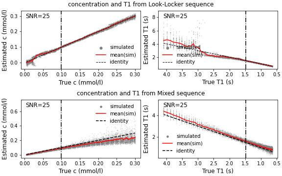

MRI noise estimation in LookLocker sequence and Mixed sequence
----------------------------------------------------------------

The concentration data used as the basis for the simulations is estimated from raw MRI data.
The MRI data is subject to noise. In what way noise propagates through the estimation
is estimated in the scripts provided in this folder.

To create the main comparison, create a virtual environment and install the requirements

```sh
python -m venv venv
source venv/bin/activate
pip install -r requirements.txt
```
and create the plot with

```
python plot_noise_combined.py
```



The tabulated results can be created with

```
python tabulate_noise_combined.py --snr 25 --samples 500 --sequence_duration 2.6
```

corresponding to Table 6-9 in the Gonzo manuscript.
